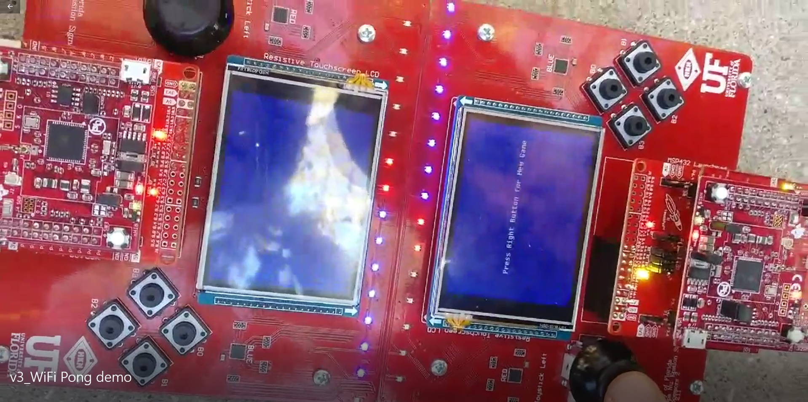

# RTOS-in-ARMv7
My implementation of a RTOS using the ARMv7 architecture on a TI MSP432 chip

## [WiFi Pong using RTOS and WiFi module (v3)][ref-id-WiFiPong]
[ref-id-WiFiPong]: https://github.com/dean4ta/RTOS-in-ARMv7/tree/master/WiFi_Pong

- dynamically kill/add threads
- Aperiodic threads added to be triggered on interrupt
- WiFi functionality demonstrated with UDP protocol to other microcontroller running identical code
- 2 player Pong game using a router as access point
- *See demo video in the WiFi_Pong Folder*

## [RTOS with sleep and periodic threads (v2)][ref-id-Periodic]
[ref-id-Periodic]: https://github.com/dean4ta/RTOS-in-ARMv7/tree/master/RR_with_periodicScheduler_and_improvedSemaphores
- sleeping functionality added to Round Robin threads
- Periodic threads added (executed at highest priority)
- semaphores have ability to block threads requesting an unavailable resource and unblocking when resource is free

## [Basic RTOS (v1)][ref-id-Basic]
[ref-id-Basic]: https://github.com/dean4ta/RTOS-in-ARMv7/tree/master/RoundRobin_Scheduler
- RTOS with round robin scheduler and naive semaphores (spin-lock)
